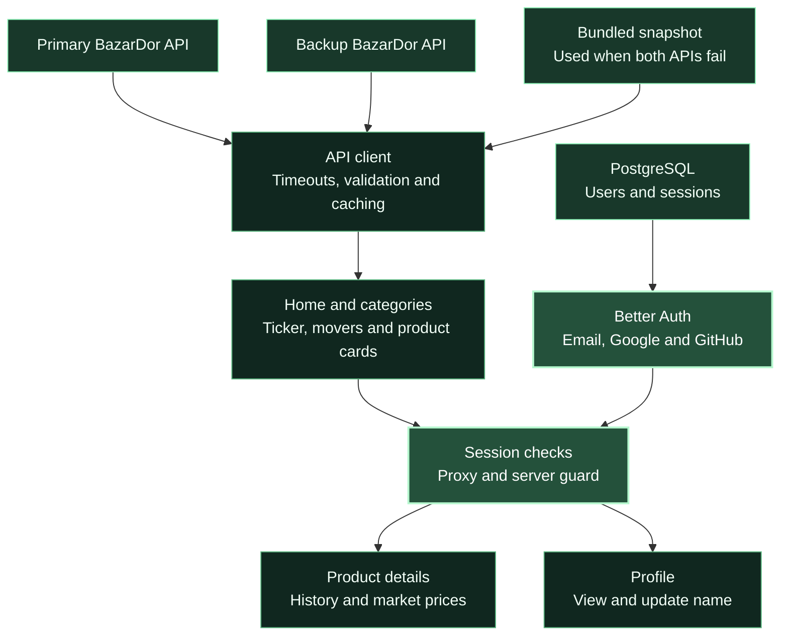

<a id="top"></a>

<div align="center">


<br />

<p>
  <a href="https://assignment-seven-sigma-ten.vercel.app/"></a>
  &nbsp;
  <a href="#about-the-project"></a>
  &nbsp;
  <a href="#the-experience"></a>
  &nbsp;
  <a href="#tech-stack"></a>
  &nbsp;
  <a href="#getting-started"></a>
</p>

<h2>Everyday essentials. Clearer decisions.</h2>

<p>Know today's prices. Compare your markets. Plan your next shop.</p>

<p><sub><strong>BANGLA FIRST</strong> &nbsp; · &nbsp; <strong>DAILY PRICE CHANGES</strong> &nbsp; · &nbsp; <strong>MARKET COMPARISONS</strong></sub></p>

</div>

<br />

## About the Project

**বাজার দর (BazarDor) brings Bangladesh's everyday commodity prices into one clear, Bangla-first interface.**

Browse rice, lentils, oil, vegetables, fish, meat, dairy and spices. See today's price,
follow changes from yesterday and sort essentials by price. Sign in to explore minimum,
maximum and average prices, historical comparisons and market prices grouped by division.

Built with Next.js and React, the project connects public price data, secure authentication
and a responsive interface. Bengali numerals have their own font, password fields include
show/hide controls, and a bundled data snapshot keeps the catalog available when both APIs
are unreachable.

## Key Features

1. **Live price ticker and daily movers.** A scrolling ticker shows every price with its ▲ ▼ change, and the home page highlights the top 6 risers and top 6 fallers.
2. **Category browsing with numeric sorting.** Eight category pages share one card design, and the sort control orders real prices correctly, including Bengali numerals.
3. **Protected product details.** After signing in, each product shows minimum, maximum and average prices, a comparison with earlier days, and prices from 12 markets grouped by division.
4. **Secure authentication.** Email and password, Google and GitHub sign in with Better Auth, toast feedback, protected route redirects and safe return URLs.
5. **Profile management.** A My Profile page and an update information form to change the display name.

## The Experience

<table>
<tr>
<td width="33%" valign="top">
<sub>01 / EXPLORE</sub>
<h3>Start with today's market.</h3>
<p>Watch the scrolling price ticker, review the top six price rises and falls, and browse essentials across eight categories.</p>
</td>
<td width="34%" valign="top">
<sub>02 / COMPARE</sub>
<h3>Find the price that matters.</h3>
<p>Sort the catalog by price, then sign in to compare minimum, maximum and average prices across markets and divisions.</p>
</td>
<td width="33%" valign="top">
<sub>03 / UNDERSTAND</sub>
<h3>See how prices have moved.</h3>
<p>Compare today's price with yesterday, last week and last month. Keep your account details up to date from your profile.</p>
</td>
</tr>
</table>

### Small details that matter

| Detail                | What you see                                                                                       |
| :-------------------- | :------------------------------------------------------------------------------------------------- |
| Price ticker          | Prices and percentage changes scroll across the page; hovering pauses the ticker.                  |
| Daily movers          | The largest six rises and falls appear separately, with green for increases and red for decreases. |
| Category browsing     | Rice, lentils, oil, vegetables, fish, meat, eggs and dairy, and spices have dedicated pages.       |
| Numeric sorting       | Default, low-to-high and high-to-low options sort actual prices correctly.                         |
| Bangla interface      | Labels, dates, units, errors and prices appear in Bangla; Bengali digits use a dedicated font.     |
| Password visibility   | Each password field has its own accessible eye button; confirmation remains independent.           |
| Authentication        | Email/password sign-in, plus Google and GitHub when their OAuth credentials are configured.        |
| Protected details     | Guests go to sign-in and return to their intended page after authentication.                       |
| Profile management    | View your profile and update your display name.                                                    |
| Feedback and recovery | Skeletons, localized errors, retries, empty states, toast messages and a custom 404.               |
| Responsive layout     | Cards, navigation and forms adapt to desktop and mobile screens.                                   |

> **Data coverage:** The bundled snapshot contains 33 products across 8 categories, with 12 market entries per product. It is a fallback dataset, not a guarantee that every displayed price is current.

<br />

## Tech Stack

<div align="center">


</div>

<br />

| Technology                 | Responsibility                                                       |
| :------------------------- | :------------------------------------------------------------------- |
| Next.js 16                 | App Router, server rendering, route protection and production builds |
| React 19                   | Components, forms, sorting and password visibility                   |
| TypeScript                 | Typed products, categories, market data and component contracts      |
| Tailwind CSS 4 + DaisyUI 5 | Responsive layout, the green theme and shared UI components          |
| Better Auth                | Email/password authentication, OAuth, sessions and rate limiting     |
| PostgreSQL + `pg`          | Persistent users, sessions and authentication data                   |
| Zod                        | API response validation, form validation and environment checks      |
| react-hot-toast            | Localized success, validation and error feedback                     |
| BazarDor APIs              | Primary and backup sources for commodity prices                      |
| Vercel                     | Application hosting                                                  |
| ESLint + Prettier          | Code checks and formatting                                           |

<details>
<summary><strong>Explore the application routes</strong></summary>

<br />

| Route                | Purpose                                              | Access         |
| :------------------- | :--------------------------------------------------- | :------------- |
| `/`                  | Hero, price ticker, daily movers and product catalog | Public         |
| `/category/[slug]`   | Category products and sorting                        | Public         |
| `/product/[slug]`    | Product summary, history and market comparisons      | Signed in      |
| `/signin`            | Email/password and social sign-in                    | Guest          |
| `/signup`            | Registration and password confirmation               | Guest          |
| `/profile`           | Account information                                  | Signed in      |
| `/profile/update`    | Update your display name                             | Signed in      |
| `/api/auth/[...all]` | Better Auth request handler                          | Auth endpoints |

Unknown paths and invalid product/category slugs render the custom not-found page.

</details>

<br />

## Under the Hood

Server components load and validate product data. Shared selectors calculate daily
movers, sort prices and group markets by division. Client components handle sorting,
form feedback and password visibility; Better Auth owns accounts and sessions.



### Data availability

| Stage            | Behavior                                                                                                                                   |
| :--------------- | :----------------------------------------------------------------------------------------------------------------------------------------- |
| Primary API      | Requests time out after 6 seconds; successful responses use a 30-minute revalidation interval.                                             |
| Backup API       | Network errors, timeouts, rate limits, server errors and invalid responses trigger failover. Unhealthy endpoints get a 60-second cooldown. |
| Bundled snapshot | When both APIs fail, supported catalog requests use validated data from `src/data`.                                                        |
| Recovery         | After the cooldown, later requests can try the APIs again.                                                                                 |

### Authentication and security

- Email/password registration validates name, email and password; the form also checks password confirmation.
- Registration and display-name updates use Zod validation on the server.
- Google and GitHub OAuth are enabled when their credential pairs are configured.
- Sessions use database persistence, `HttpOnly` cookies and secure cookies in production.
- Product and profile routes check authentication in both the proxy and server page.
- Safe callback paths keep post-login redirects within the application.
- Database-backed rate limits protect sign-in, sign-up and profile updates.
- A nonce-based Content Security Policy and security headers protect the application.
- Secrets stay in ignored environment files.

<details>
<summary><strong>Project structure</strong></summary>

```text
src/
  app/
    page.tsx                  # Home and daily movers
    category/[slug]/          # Category listings
    product/[slug]/           # Protected product details
    signin/ signup/           # Authentication pages
    profile/                  # Profile and name updates
    api/auth/[...all]/        # Better Auth handler
    globals.css               # Theme and Bengali numeral font
  components/
    auth/                     # Forms and password eye controls
    home/                     # Hero and home sections
    layout/                   # Header, ticker and footer
    product/                  # Cards, sorting and comparisons
    ui/                       # Shared UI and error states
  config/                     # Routes, site and category constants
  data/                       # Bundled product/category snapshots
  lib/
    api/                      # API validation, failover and fallback
    auth/                     # Authentication and session helpers
    format/                   # Bengali prices, numbers and dates
    products/                 # Sorting, movers and market grouping
    validation/               # Form schemas and safe redirects
  proxy.ts                    # CSP and optimistic session guard
public/
  readme-hero.svg              # Animated 3D README banner
  fonts/                      # Bengali numeral font and license
scripts/
  auth.config.ts              # Authentication migration configuration
docs/
  repository-description.txt  # Copy-ready GitHub About description
```

</details>

<br />

## Getting Started

Use Node.js 20.9 or newer, npm and a PostgreSQL database. Neon is one supported option.

```bash
git clone https://github.com/SamaunRezvi/assignment_seven.git
cd assignment_seven
npm install
cp .env.example .env
```

On Windows PowerShell, use `Copy-Item .env.example .env` for the last command.

### Environment variables

| Variable                                   | Purpose                                                                          |
| :----------------------------------------- | :------------------------------------------------------------------------------- |
| `DATABASE_URL`                             | Pooled PostgreSQL connection string; `POSTGRES_URL` is also accepted at runtime. |
| `DATABASE_URL_UNPOOLED`                    | Optional direct database connection for migrations.                              |
| `BETTER_AUTH_SECRET`                       | A random secret of at least 32 characters.                                       |
| `BETTER_AUTH_URL`                          | Application origin, such as `http://localhost:3000`.                             |
| `GOOGLE_CLIENT_ID`, `GOOGLE_CLIENT_SECRET` | Optional Google OAuth credential pair.                                           |
| `GITHUB_CLIENT_ID`, `GITHUB_CLIENT_SECRET` | Optional GitHub OAuth credential pair.                                           |
| `API_BASE_URL`                             | Optional primary price API URL; defaults are in `.env.example`.                  |
| `API_FALLBACK_BASE_URL`                    | Optional backup price API URL.                                                   |

Generate a secret locally:

```bash
node -e "console.log(require('node:crypto').randomBytes(32).toString('base64'))"
```

Set up the database tables and start development:

```bash
npm run auth:migrate
npm run dev
```

Open the local URL printed in the terminal, usually `http://localhost:3000`.

<details>
<summary><strong>Configure Google and GitHub sign-in</strong></summary>

<br />

Create OAuth applications with these callback URLs:

| Provider | Callback                                     |
| :------- | :------------------------------------------- |
| Google   | `{BETTER_AUTH_URL}/api/auth/callback/google` |
| GitHub   | `{BETTER_AUTH_URL}/api/auth/callback/github` |

Set both the client ID and client secret for each provider you want to enable.
Email/password authentication works without social provider credentials.

</details>

### Available commands

| Task                                | Command                |
| :---------------------------------- | :--------------------- |
| Start development                   | `npm run dev`          |
| Build for production                | `npm run build`        |
| Start the production server         | `npm run start`        |
| Check TypeScript                    | `npm run typecheck`    |
| Run ESLint                          | `npm run lint`         |
| Format source files                 | `npm run format`       |
| Create/update authentication tables | `npm run auth:migrate` |
| Audit production dependencies       | `npm run audit:prod`   |

<br />

## Deployment

1. Push the repository to GitHub and import the project into Vercel.
2. Set required environment variables and the production origin for `BETTER_AUTH_URL`.
3. Run the authentication migration against the production database.
4. Register production callback URLs with your configured OAuth providers.
5. Build and deploy; dynamic routes render on demand.

## Project Links

| Resource               | Link                                                                             |
| :--------------------- | :------------------------------------------------------------------------------- |
| GitHub repository      | [SamaunRezvi/assignment_seven](https://github.com/SamaunRezvi/assignment_seven)  |
| Live application       | [BazarDor - daily market prices](https://assignment-seven-sigma-ten.vercel.app/) |
| Repository description | [Copy-ready GitHub About text](./docs/repository-description.txt)                |

## Project Note

Built as a Programming Hero learning assignment. Prices vary between markets, and fallback
data may be older than current market prices. The bundled numeral font carries its own
[SIL Open Font License](./public/fonts/OFL-noto-sans-bengali.txt).

<br />

<div align="center">

<p><strong>BAZARDOR</strong></p>
<p><sub>KNOW YOUR MARKET · PLAN YOUR SHOP</sub></p>

<a href="https://assignment-seven-sigma-ten.vercel.app/">Explore BazarDor ↗</a> &nbsp; · &nbsp; <a href="#top">Back to top ↑</a>

</div>
