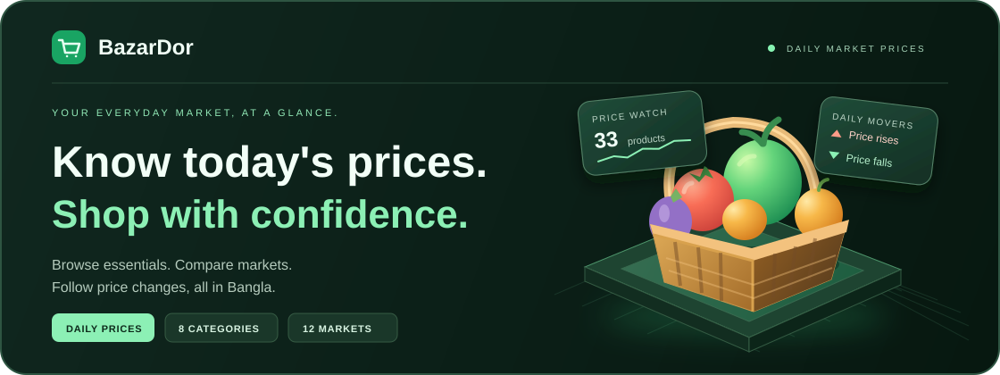

<a id="top"></a>

<div align="center">



<br />

<h1>🛒 বাজার দর | BazarDor</h1>

<p>
  <a href="https://assignment-seven-sigma-ten.vercel.app/"></a>
  &nbsp;
  <a href="#about-the-project"></a>
  &nbsp;
  <a href="#the-experience"></a>
  &nbsp;
  <a href="#tech-stack"></a>
  &nbsp;
  <a href="#getting-started"></a>
</p>

<h2>Everyday essentials. Clearer decisions.</h2>

<p>Know today's prices. Compare your markets. Plan your next shop.</p>

<p><sub><strong>BANGLA FIRST</strong> &nbsp; · &nbsp; <strong>DAILY PRICE CHANGES</strong> &nbsp; · &nbsp; <strong>MARKET COMPARISONS</strong></sub></p>

</div>

<br />

## About the Project

**বাজার দর (BazarDor) brings Bangladesh's everyday commodity prices into one clear, Bangla-first interface.**

Browse rice, lentils, oil, vegetables, fish, meat, dairy and spices. See today's price,
follow changes from yesterday and sort essentials by price. Sign in to explore minimum,
maximum and average prices, historical comparisons and market prices grouped by division.

Built with Next.js and React, the project combines public price data, account sign in and
a responsive interface. Bengali numerals have their own font, and the app keeps working with
the last known prices if the price service is temporarily unavailable.

## Key Features

1. **Live price ticker and daily movers.** A scrolling ticker shows every price with its ▲ ▼ change, and the home page highlights the top 6 risers and top 6 fallers.
2. **Category browsing with numeric sorting.** Eight category pages share one card design, and the sort control orders real prices correctly, including Bengali numerals.
3. **Detailed product pages.** After signing in, each product shows minimum, maximum and average prices, a comparison with earlier days, and 12 markets grouped by division, each with minimum, maximum and average prices.
4. **Easy sign in.** Create an account with email and password, or continue with Google or GitHub, with clear toast feedback along the way.
5. **Profile management.** A My Profile page and an update information form to change the display name.

## The Experience

<table>
<tr>
<td width="33%" valign="top">
<sub>01 / EXPLORE</sub>
<h3>Start with today's market.</h3>
<p>Watch the scrolling price ticker, review the top six price rises and falls, and browse essentials across eight categories.</p>
</td>
<td width="34%" valign="top">
<sub>02 / COMPARE</sub>
<h3>Find the price that matters.</h3>
<p>Sort the catalog by price, then sign in to compare minimum, maximum and average prices across markets and divisions.</p>
</td>
<td width="33%" valign="top">
<sub>03 / UNDERSTAND</sub>
<h3>See how prices have moved.</h3>
<p>Compare today's price with yesterday, last week and last month. Keep your account details up to date from your profile.</p>
</td>
</tr>
</table>

### Small details that matter

| Detail                | What you see                                                                                       |
| :-------------------- | :------------------------------------------------------------------------------------------------- |
| Price ticker          | Prices and percentage changes scroll across the page; hovering pauses the ticker.                  |
| Daily movers          | The largest six rises and falls appear separately, with green for increases and red for decreases. |
| Category browsing     | Rice, lentils, oil, vegetables, fish, meat, eggs and dairy, and spices have dedicated pages.       |
| Numeric sorting       | Default, low-to-high and high-to-low options sort actual prices correctly.                         |
| Bangla interface      | Labels, dates, units, errors and prices appear in Bangla; Bengali digits use a dedicated font.     |
| Password visibility   | Each password field has its own eye button to show or hide what you type.                          |
| Social sign in        | Continue with Google or GitHub in a single step.                                                   |
| Profile management    | View your profile and update your display name.                                                    |
| Feedback and recovery | Skeletons, friendly errors, retries, empty states, toast messages and a custom 404.                |
| Responsive layout     | Cards, navigation and forms adapt to desktop and mobile screens.                                   |

> **Note:** Prices are indicative and may differ from what you pay in a shop. They can be slightly older than current market prices.

<br />

## Tech Stack

<div align="center">


</div>

<br />

| Technology             | Responsibility                                    |
| :--------------------- | :------------------------------------------------ |
| Next.js (App Router)   | Pages, routing and server rendering               |
| React                  | Components, forms and sorting                     |
| TypeScript             | Typed products, categories and market data        |
| Tailwind CSS + DaisyUI | Responsive layout, theme and shared UI components |
| Better Auth            | Email and password, Google and GitHub sign in     |
| PostgreSQL             | Storage for user accounts                         |
| react-hot-toast        | Success, validation and error messages            |
| Vercel                 | Application hosting                               |
| ESLint + Prettier      | Code checks and formatting                        |

<br />

## Getting Started

Requirements: Node.js 20.9 or newer.

```bash
git clone https://github.com/SamaunRezvi/assignment_seven.git
cd assignment_seven
npm install
cp .env.example .env
npm run dev
```

Fill `.env` with your own values before starting the app, then open `http://localhost:3000`.

| Command         | Description                  |
| :-------------- | :--------------------------- |
| `npm run dev`   | Start the development server |
| `npm run build` | Create a production build    |
| `npm run start` | Serve the production build   |
| `npm run lint`  | Check the code with ESLint   |

<br />

## Project Links

| Resource          | Link                                                                             |
| :---------------- | :------------------------------------------------------------------------------- |
| GitHub repository | [SamaunRezvi/assignment_seven](https://github.com/SamaunRezvi/assignment_seven)  |
| Live application  | [BazarDor - Daily market prices](https://assignment-seven-sigma-ten.vercel.app/) |

## Project Note

Built as a Programming Hero learning assignment. Prices vary between markets and may be
older than current market prices. The bundled numeral font carries its own
[SIL Open Font License](./public/fonts/OFL-noto-sans-bengali.txt).

**Good to know:** the live site runs on free hosting tiers. If nobody has used it for a few
minutes, the free database goes to sleep and the first sign in or sign up can take a couple
of seconds longer. It wakes up by itself and works normally right after, and no data is lost.

<br />

<div align="center">

<p><strong>BAZARDOR</strong></p>
<p><sub>KNOW YOUR MARKET · PLAN YOUR SHOP</sub></p>

<a href="https://assignment-seven-sigma-ten.vercel.app/">Explore BazarDor ↗</a> &nbsp; · &nbsp; <a href="#top">Back to top ↑</a>

</div>
